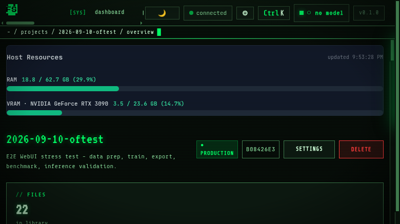
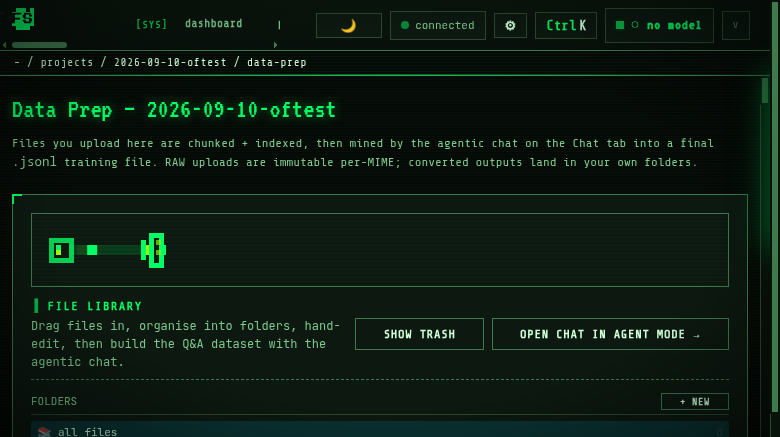
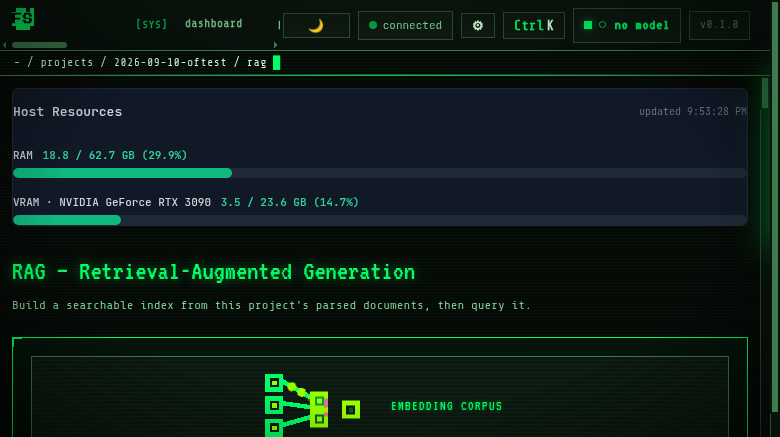
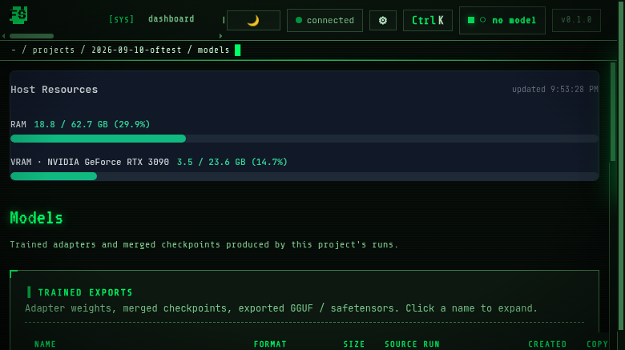
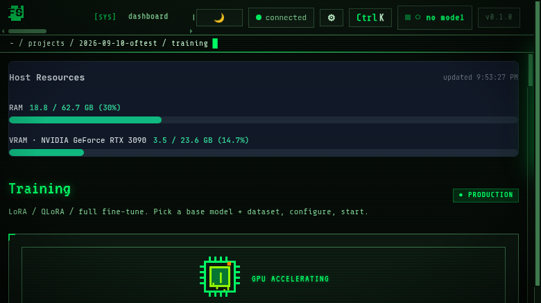
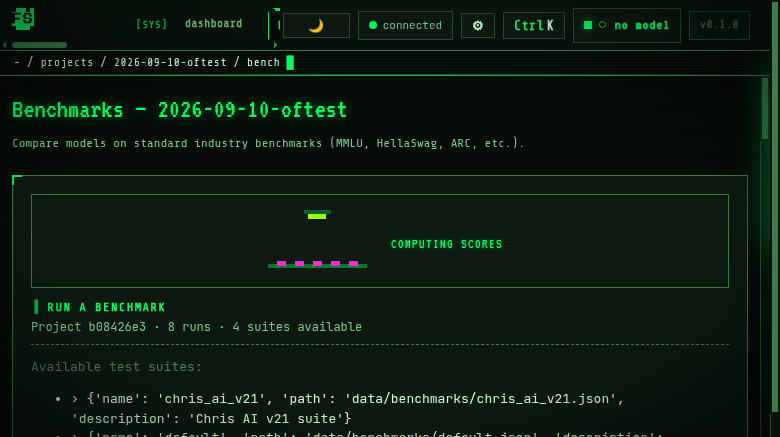
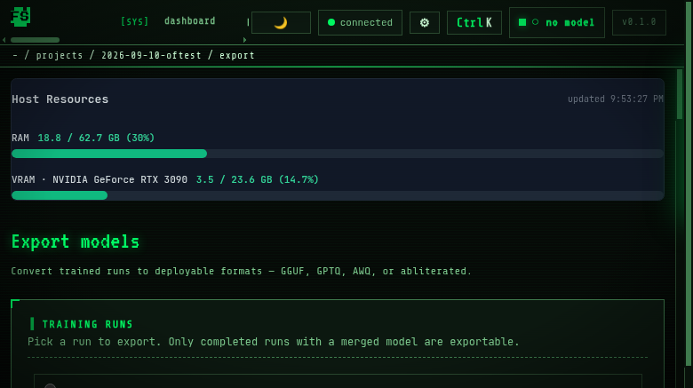
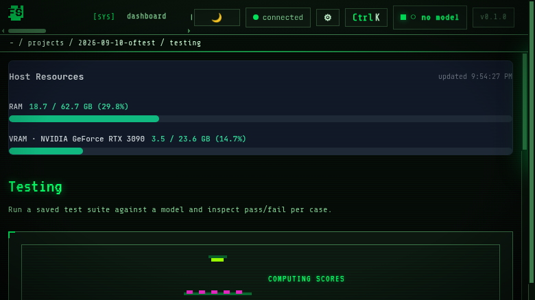
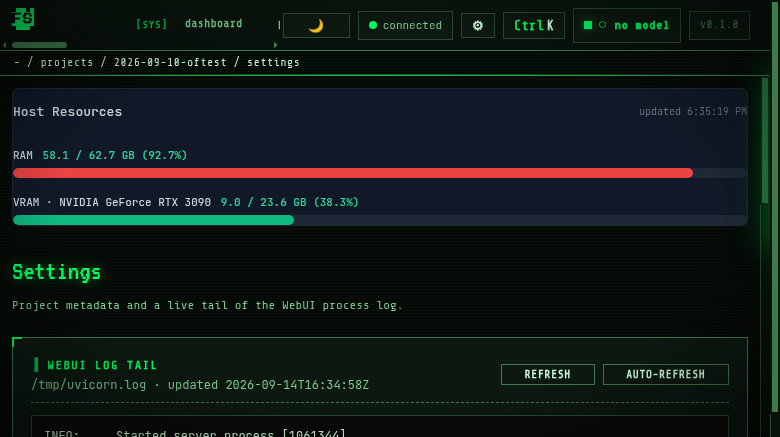

# ⚡ Finetune Studio

**Train, run, and evaluate large language models — entirely on your own hardware.**

A self-hosted workshop that gives you full control over the model training
lifecycle: build RAG corpora, fine-tune with LoRA, chat with vision models,
run benchmarks, compare runs side-by-side — all from one dark-themed WebUI
that lives in your browser. The UI, the data pipeline, the settings log tail,
and the E2E regression suite all live in one repo.

[](https://www.python.org/downloads/)
[](LICENSE)
[](#installation)
[](#how-it-works)
[](https://genortg.github.io/finetune-studio/)
[](#how-it-works)

---

## Table of contents

- [Why I built this](#why-i-built-this)
- [Who it's for](#who-its-for)
- [The four use cases](#the-four-use-cases)
- [What's new vs v1](#whats-new-vs-v1)
- [Why this over doing it manually?](#why-this-over-doing-it-manually)
- [Walkthrough — the pages](#walkthrough--the-pages)
- [Quickstart](#quickstart)
- [Installation](#installation)
- [How it works](#how-it-works)
- [Tech stack](#tech-stack)
- [Documentation](#documentation)
- [License & attributions](#license--attributions)

---

## Why I built this

Training a language model today involves juggling **dozens of moving pieces**:
managing CUDA dependencies, downloading and quantizing weights, building
chunking pipelines for RAG, writing training loops, babysitting VRAM,
finding a benchmark suite, monitoring loss curves, packaging the result,
serving it, comparing it against the base model…

There are great point-solutions for each piece (HuggingFace TRL, LM Studio,
ChromaDB, llama.cpp, MMLU…) but **no single workshop that wraps the whole
lifecycle in one coherent interface**. You end up with five tools open,
three terminal windows, and a Notion page of "things to remember."

Finetune Studio exists to fix that. It is a **browser-based control room**
for everything between *raw documents* and *a chat-ready, benchmarked,
fine-tuned model* — running entirely on your hardware, with no cloud
dependency.

The goal isn't to compete with industrial training platforms. It's to give
independent researchers, hackers, hobbyists, small teams, and educators a
**single place to do serious work** without the friction of cobbling it
together themselves.

---

## Who it's for

- **Independent researchers** prototyping custom models without paying cloud
  bills.
- **Hobbyists** who want to fine-tune Llama 3 on their RTX 3090 without
  reading ten blog posts first.
- **Small teams** that need a private inference + RAG server and don't want
  to ship sensitive data to a third party.
- **Educators** teaching an LLM workshop — one app, all the steps visible.
- **Anyone** who wants a polished local alternative to closed hosted
  services.

You don't need all the use cases. Most users start with one (RAG, or
fine-tuning, or just chatting) and grow from there.

---

## The four use cases

You don't have to use every feature. Pick what you need.

### Use case 1 — Build a RAG on private documents

> *"I have a pile of PDFs and I want to ask questions about them in plain
> English — without uploading anything to the cloud."*

The **RAG** workflow takes a folder of files, chunks them, embeds them
into a vector store, and exposes them for similarity search. The studio
handles:

- File ingestion (PDF, DOCX, TXT, MD, HTML, code, CSV, JSON, images via
  OCR)
- Configurable chunking strategy
- Embedder model selection (any SentenceTransformer-compatible model)
- Live build progress via Server-Sent Events
- A docs-indexed panel showing every indexed chunk with a per-doc rebuild
  button + view-chunks modal

📸 **See:** the RAG page with the live corpus inventory.

### Use case 2 — Fine-tune a model on your data

> *"I want to teach a small open model how my company talks, how to answer
> support questions, how to follow our style guide."*

The **Training** workflow lets you point the studio at a JSONL of
prompt/completion pairs (or your own dataset), pick a base model, and run a
supervised fine-tune (SFT) with LoRA or QLoRA. The studio handles:

- Adapter merging, model export, VRAM profile checkpoints
- Real-time loss + step counter, gradient norm, learning rate
- Configurable LoRA rank, target modules, batch size
- A "bake" step that produces a self-contained model you can load in
  inference
- Per past-run Actions (⭐ Set Production, ▶ Inference, ⬇ Download) so
  you can promote / inspect / pull down any of your previous runs

📸 **See:** the Training page with the live CpuChip sprite that pulses as
training runs.

### Use case 3 — Benchmark before you ship

> *"I trained two variants. Which one is actually better?"*

The **Benchmarks** workflow runs standard evaluations (MMLU, HellaSwag,
ARC, TruthfulQA, GSM8K, Winogrande) and gives you a **single comparison
table**. Two tabs: **Recent scores** (the rolling history of every scored
run) and **Compare two runs** (pick any two trained exports, get the
per-suite Δ table so you can see at a glance which one is better at
what).

📸 **See:** the Benchmarks page with the live score bars and the compare
results panel.

### Use case 4 — Just chat with local models

> *"I want to run Llama 3 locally with my own chat history, image support,
> and a clean UI."*

The **Inference** page is a polished chat client. Pick any GGUF or
safetensors model on disk, load it (with auto-unload on idle to free
VRAM), and chat. Image input for multimodal models. Per-session
temperature / top-p / system prompt. Conversation persists across reloads.

📸 **See:** the Inference page with the RobotHead sprite that pulses its
mouth as tokens stream in.

---

## What's new vs v1

The studio has grown up. Eight UI audit + eight file-library items shipped
between Sept and today, on top of the Phase 1 dashboard/file-browser/
data-editor foundation. Highlights:

- **Benchmarks compare tab** — pick any two trained exports, get the
  per-suite score diff (Δ = B − A, colored).
- **Documents-indexed panel in RAG** — see every indexed chunk, status,
  and a per-doc Rebuild button (PortableRAG corpus backed by parquet +
  sources, no SQLite).
- **Per-export expand rows** on Models and Export pages — click the
  export name to see the parent training run, the training settings, and
  the top-level directory contents (file sizes + names). Same row carries a
  **▶ Open in inference** button that loads the model and jumps to
  inference.
- **Per-file rename + hard-purge** on the data library — the buttons
  have always been there but the APIs are real now (`PATCH .../rename`,
  `POST .../purge`). The rename endpoint handles files without
  `file_versions` rows (created before the versions table existed) by
  globbing the storage tree.
- **Parsed MD preview** on the data library — click 📝 on any converted
  file to see the actual converted MD streamed from the server
  (`GET /api/projects/{pid}/files/{fid}/parsed`).
- **Per-project Settings page** — including a **WebUI log tail** card
  that reads `/tmp/uvicorn.log` with Refresh + 5-second Auto-refresh
  (`GET /api/projects/{pid}/logs?lines=N`).
- **70/70 green** Playwright E2E suite in CI — the whole app
  smoke-tested end-to-end on `http://fan-dragon:7860`, every nightly.

---

## Why this over doing it manually?

| What you'd do manually | What Finetune Studio does |
|---|---|
| Write a Python script to download weights from HF | Browse HF Explorer in-app, click download |
| Configure transformers + accelerator + trl + peft + bitsandbytes | Pick base model + LoRA rank + batch size in a form |
| Write your own chunking + embedding loop | Click "Build" — chunking, embedding, indexing all wired |
| Open 4 terminal windows to monitor training | Watch the live progress bar in one panel |
| Hand-craft an MMLU eval script from scratch | Pick "MMLU", click Run, get a score table |
| Open a second tab to compare two trained runs | Pick run A + run B, click Run comparison, get the diff |
| Lather / rinse / repeat for every file rename | Click rename, type new name, ⏎ |
| Lose an afternoon to CUDA install issues | One `./install.sh` does it |
| Re-discover package version conflicts every 3 months | Pinned dependencies, versioned upgrades |
| Debug a model load failure from "ENOMEM" | Actionable error: "needs ~19.8 GB, only 10.3 free; top consumers: comfyui(pid 2063394)" |

The point isn't that any single piece is impossible. The point is that
**all of it is now in one place**, with a shared project concept that ties
it together, and all your data lives in `~/.finetune-studio/` where you
can find it.

---

## Walkthrough — the pages

### Dashboard (`/`)

The home view. Host resources (RAM / VRAM bars updated live), your
projects, quick-create buttons.


### Project overview (`/projects/{pid}`)

Per-project dashboard: data count, RAG status, training run history,
latest benchmark scores, with all of the project context in one place.



### Data prep (`/projects/{pid}/data-prep`)

Upload files, configure chunking + difficulty, kick off a QA-generation
job. The DataStream sprite shows bytes flowing through the parser. The
**file library** underneath gives you SHA-256 dedup, MIME-auto-routed
immutable raws, your own folders, versioning, and a 7-day soft-delete
trash — plus per-file **rename** and **per-file purge** buttons that hit
real APIs.



### RAG (`/projects/{pid}/rag`)

Build a corpus, search it, tune retrieval parameters. A new
**Documents-indexed panel** at the bottom of the page lists every indexed
chunk with status, last-indexed timestamp, and a per-doc Rebuild button +
View-chunks modal. Corpus is persisted on disk as `~/.finetune-studio/
rag_corpora/{pid}/{chunks.parquet,sources/*.txt}`. The CorpusNode sprite
shows document nodes connecting to embedding vectors in real time.



### Models (`/projects/{pid}/models`)

Every trained export from every run, in a 7-column table (Name / Format /
Size / Source run / Created / Copy path / Actions). Click any row's name
to **expand** it and see the parent training run, the training settings
(LR, rank, batch, epochs, max seq length, merge-on-save), and a top-level
directory listing. ▶ Open in inference jumps straight to chat.



### Training (`/projects/{pid}/training`)

Configure a fine-tune, watch loss curves live. Each past run in the
**Past runs** table now carries Actions (⭐ Set Production, ▶ Inference,
⬇ Download) so you can promote / inspect / pull down any of your
previous runs without re-opening individual pages. The CpuChip sprite
flickers as the GPU accelerates.



### Benchmarks (`/projects/{pid}/benchmarks`)

Run MMLU / HellaSwag / ARC / TruthfulQA / GSM8K / Winogrande. Two tabs:
**Recent scores** (live history) and **Compare two runs** (pickers + a
per-suite Δ table). The BenchBars sprite fills in as scores arrive.



### Export (`/projects/{pid}/export`)

Pick a run, pick a format, hit RUN. The trained-exports table uses the
same expand-row pattern as Models — click a row to inspect its contents,
then ▶ Open in inference. The radio/format picker is preserved exactly
as before.



### Testing (`/projects/{pid}/testing`)

Generate QA pairs from a trained model against the prepared dataset.
Suite dropdown replaces the old free-text input — picks come straight
from the available suites.



### Settings (`/projects/{pid}/settings`)

Per-project settings including a **WebUI log tail** card that reads
`/tmp/uvicorn.log` with Refresh + 5-second Auto-refresh. Handy for
debugging long-running jobs without SSH-ing into the box.



---

The session bar at the top of every page is a Tmux-style tab strip with
three groups: **[SYS]**, **[PROJECT]**, **[TOOLS]**. The active tab has a
phosphor-green notch that punches into the active-path bar below it.
`Ctrl+K` opens the command palette — fuzzy-search any page in any
project.

---

## Quickstart

```bash
git clone https://github.com/GenorTG/finetune-studio.git
cd finetune-studio
./install.sh                       # auto-detects GPU
source .venv/bin/activate
fts web --host 0.0.0.0 --port 7860
```

Open http://localhost:7860. The first visit walks you through an 8-step
onboarding tour.

---

## Installation

See **[docs/INSTALL.md](docs/INSTALL.md)** for full step-by-step
instructions covering Linux (Ubuntu / Fedora / Arch), Windows 10/11 (WSL2),
and macOS (Intel + Apple Silicon), with prerequisites and how to install
each one from its official source.

---

## How it works

```
┌───────────────────── BROWSER (any modern) ─────────────────────┐
│                                                                │
│   Tmux-style session bar ─── project tabs ── status pill       │
│   ┌──────────────────────────────┐  ┌────────────────────────┐ │
│   │ FastAPI + Jinja2 templates   │  │ Live SSE for progress  │ │
│   │ Vanilla JS / CSS (no build)  │  │ Chat streaming         │ │
│   │ Playwright-driven E2E 70/70  │  │ Tail /api/logs         │ │
│   └──────────────────────────────┘  └────────────────────────┘ │
└────────────────────────────────────────────────────────────────┘
                              │  HTTP + Server-Sent Events
                              ▼
┌───────────────────── PYTHON SERVER (local) ─────────────────────┐
│                                                                │
│   FastAPI app ── projects API ── RAG pipeline                  │
│               ── training runner (trl+peft)                    │
│               ── inference (transformers OR llama.cpp)         │
│               ── benchmarks (MMLU/HellaSwag/...)               │
│                                                                │
│   Storage: SQLite for project metadata                         │
│            + ~/.cache/huggingface for model weights             │
│            + ~/.finetune-studio/rag_corpora/{pid}/  (parquet)   │
└────────────────────────────────────────────────────────────────┘
```

- **Backend:** FastAPI + Jinja2. ASGI server (Uvicorn).
- **Frontend:** Vanilla HTML + CSS + JS. No build step. Sprites are
  inline SVG with CSS keyframe animations.
- **Storage:** SQLite for project metadata, PortableRAG corpus (parquet +
  per-project sources dir) for RAG vectors, HuggingFace `~/.cache/`
  for model weights.
- **Streaming:** Server-Sent Events for live progress on RAG build,
  training, and benchmark runs; `/api/logs` for on-demand log tail
  reading from `/tmp/uvicorn.log`.
- **Inference:** Either HuggingFace Transformers (full precision / LoRA)
  or llama.cpp (GGUF quantized).
- **Testing:** Playwright live-browser tests in `tests/e2e_ui_qa.py` —
  70/70 green, runs headless on `fan-dragon:7860` from `tests/run_qa.sh`.
- **Updates:** self-healing pipeline — `./update.sh` or Settings → Apply
  update (pull → venv repair → dep sync → migrations → restart), with
  startup reconciliation of interrupted runs.

---

## Tech stack

Python — `fastapi` `uvicorn` `jinja2` `sqlite3` (stdlib) `pydantic`
ML — `torch` `transformers` `trl` `peft` `bitsandbytes`
RAG — `sentence-transformers` `PortableRAG` (parquet + sources) `llama-cpp-python`
Web — vanilla HTML/CSS/JS, Google Fonts (JetBrains Mono, Share Tech Mono,
VT323, Press Start 2P)
Tests — `playwright`

Full list with versions and licenses → **[docs/ATTRIBUTIONS.md](docs/ATTRIBUTIONS.md)**

---

## Documentation

- **[docs/INSTALL.md](docs/INSTALL.md)** — install on Linux / macOS / Windows, prerequisites, troubleshooting
- **[docs/ARCHITECTURE.md](docs/ARCHITECTURE.md)** — layers, route map, data flow, disk layout
- **[docs/DEPENDENCIES.md](docs/DEPENDENCIES.md)** — every dependency mapped to its consumers
- **[docs/DEPLOYMENT.md](docs/DEPLOYMENT.md)** — service, update pipeline, ops runbook
- **[docs/REFACTOR-SPEC.md](docs/REFACTOR-SPEC.md)** — the locked architecture decisions + roadmap
- **[docs/ATTRIBUTIONS.md](docs/ATTRIBUTIONS.md)** — every package, version, license
- **[⚡ Presentation page](https://genortg.github.io/finetune-studio/)** — the gallery version of this README
- **/settings** — live debug info on your running instance (version, GPU, packages, paths) **+ WebUI log tail card**
- Tools → Settings → **Replay Tutorial** — built-in onboarding, always available

---

## Contributing

PRs welcome. Open an issue first if the change is large — this codebase
prefers clear minimal patches over sweeping refactors. The studio tests
itself via live browser (`tests/e2e_ui_qa.py`) and we ask new features
add at least one assertion there. The current bar is **70/70 green**.

---

## License & attributions

**[PolyForm Noncommercial License 1.0.0](https://polyformproject.org/licenses/noncommercial/1.0.0)** plus Finetune Studio Additional Terms. See `LICENSE`. Personal, scientific, and non-commercial use is free. Commercial use and commercial model training require a separate paid license — see `LICENSE` (Additional Terms) and `docs/LEGAL.md`.

> Note: this is *source-available* software, not an OSI-approved open-source license, because it restricts commercial use.

Every dependency used is open source — see
**[docs/ATTRIBUTIONS.md](docs/ATTRIBUTIONS.md)** for the full list,
versions, and licenses. Thank you to the maintainers of PyTorch,
Transformers, PEFT, llama.cpp, PortableRAG, SentenceTransformers,
FastAPI, Jinja, and the rest of the open-source ecosystem this is built
on.

---

<div align="center">

Built by a hacker, for hackers. No cloud, no telemetry, no lock-in.

</div>
