<div align="center">

# ⚡ Finetune Studio

**Train, run, and evaluate large language models — entirely on your own hardware.**

A self-hosted workshop that gives you full control over the model training
lifecycle: build RAG corpora, fine-tune with LoRA, chat with vision models,
run benchmarks — all from one dark-themed WebUI that lives in your browser.

[](https://www.python.org/downloads/)
[](LICENSE)
[](#installation)
[](#how-it-works)

</div>

---

## Table of contents

- [Why I built this](#why-i-built-this)
- [Who it's for](#who-its-for)
- [The use cases](#the-use-cases)
  - [Use case 1 — Build a RAG on private documents](#use-case-1--build-a-rag-on-private-documents)
  - [Use case 2 — Fine-tune a model on your data](#use-case-2--fine-tune-a-model-on-your-data)
  - [Use case 3 — Benchmark before you ship](#use-case-3--benchmark-before-you-ship)
  - [Use case 4 — Just chat with local models](#use-case-4--just-chat-with-local-models)
- [Why this over doing it manually?](#why-this-over-doing-it-manually)
- [Walkthrough — the pages](#walkthrough--the-pages)
- [Quickstart](#quickstart)
- [Installation](#installation)
- [How it works](#how-it-works)
- [Tech stack](#tech-stack)
- [Documentation](#documentation)
- [License & attributions](#license--attributions)

---

## Why I built this

Training a language model today involves juggling **dozens of moving pieces**:
managing CUDA dependencies, downloading and quantizing weights, building
chunking pipelines for RAG, writing training loops, babysitting VRAM,
finding a benchmark suite, monitoring loss curves, packaging the result,
serving it, comparing it against the base model…

There are great point-solutions for each piece (HuggingFace TRL, LM Studio,
ChromaDB, llama.cpp, MMLU…) but **no single workshop that wraps the whole
lifecycle in one coherent interface**. You end up with five tools open,
three terminal windows, and a Notion page of "things to remember."

Finetune Studio exists to fix that. It is a **browser-based control room**
for everything between *raw documents* and *a chat-ready, benchmarked,
fine-tuned model* — running entirely on your hardware, with no cloud
dependency.

The goal isn't to compete with industrial training platforms. It's to give
independent researchers, hackers, hobbyists, small teams, and educators a
**single place to do serious work** without the friction of cobbling it
together themselves.

---

## Who it's for

- **Independent researchers** prototyping custom models without paying cloud
  bills.
- **Hobbyists** who want to fine-tune Llama 3 on their RTX 3090 without
  reading ten blog posts first.
- **Small teams** that need a private inference + RAG server and don't want
  to ship sensitive data to a third party.
- **Educators** teaching an LLM workshop — one app, all the steps visible.
- **Anyone** who wants a polished local alternative to closed hosted
  services.

You don't need all the use cases. Most users start with one (RAG, or
fine-tuning, or just chatting) and grow from there.

---

## The use cases

You don't have to use every feature. Pick what you need.

### Use case 1 — Build a RAG on private documents

> *"I have a pile of PDFs and I want to ask questions about them in plain
> English — without uploading anything to the cloud."*

The **RAG** workflow takes a folder of files, chunks them, embeds them
into a vector store, and exposes them for similarity search. The studio
handles:

- File ingestion (PDF, DOCX, TXT, MD, HTML, code, CSV, JSON, images via
  OCR)
- Configurable chunking strategy
- Embedder model selection (any SentenceTransformer-compatible model)
- Live build progress via Server-Sent Events
- Persistent index on disk
- A search playground where you can tune `top_k`, similarity threshold,
  and reranker model

📸 **See:** the RAG build page showing live progress through the chunk →
embed → index pipeline.

### Use case 2 — Fine-tune a model on your data

> *"I want to teach a small open model how my company talks, how to answer
> support questions, how to follow our style guide."*

The **Training** workflow lets you point the studio at a JSONL of
prompt/completion pairs (or your own dataset), pick a base model, and run a
supervised fine-tune (SFT) with LoRA or QLoRA. The studio handles:

- Adapter merging, model export, VRAM profile checkpoints
- Real-time loss + step counter, gradient norm, learning rate
- Configurable LoRA rank, target modules, batch size
- A "bake" step that produces a self-contained model you can load in
  inference

📸 **See:** the Training page with the live CpuChip sprite that pulses as
training runs.

### Use case 3 — Benchmark before you ship

> *"I trained two variants. Which one is actually better?"*

The **Benchmarks** workflow runs standard evaluations (MMLU, HellaSwag,
ARC, TruthfulQA, GSM8K, Winogrande) and gives you a single comparison
table. Side-by-side results, history across runs, exportable JSON.

📸 **See:** the Benchmarks page with live score bars.

### Use case 4 — Just chat with local models

> *"I want to run Llama 3 locally with my own chat history, image support,
> and a clean UI."*

The **Inference** page is a polished chat client. Pick any GGUF or
safetensors model on disk, load it (with auto-unload on idle to free
VRAM), and chat. Image input for multimodal models. Per-session
temperature / top-p / system prompt. Conversation persists across reloads.

📸 **See:** the Inference page with the RobotHead sprite that pulses its
mouth as tokens stream in.

---

## Why this over doing it manually?

| What you'd do manually | What Finetune Studio does |
|---|---|
| Write a Python script to download weights from HF | Browse HF Explorer in-app, click download |
| Configure transformers + accelerator + trl + peft + bitsandbytes | Pick base model + LoRA rank + batch size in a form |
| Write your own chunking + embedding loop | Click "Build" — chunking, embedding, indexing all wired |
| Open 4 terminal windows to monitor training | Watch the live progress bar in one panel |
| Hand-craft an MMLU eval script from scratch | Pick "MMLU", click Run, get a score table |
| Glue FastAPI + Jinja + websocket just to chat | Use the bundled inference chat |
| Lose an afternoon to CUDA install issues | One `./install.sh` does it |
| Re-discover package version conflicts every 3 months | Pinned dependencies, versioned upgrades |

The point isn't that any single piece is impossible. The point is that
**all of it is now in one place**, with a shared project concept that ties
it together, and all your data lives in `~/.finetune-studio/` where you
can find it.

---

## Walkthrough — the pages

### Dashboard (`/`)

The home view. System status, your projects, quick-create buttons.

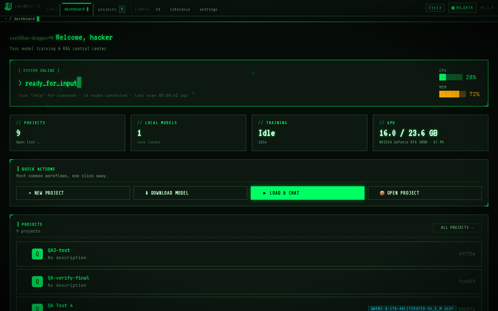

---

### Projects (`/projects`)

Each project is a self-contained bundle: data, training, RAG, chat,
benchmarks. Create as many as you need.

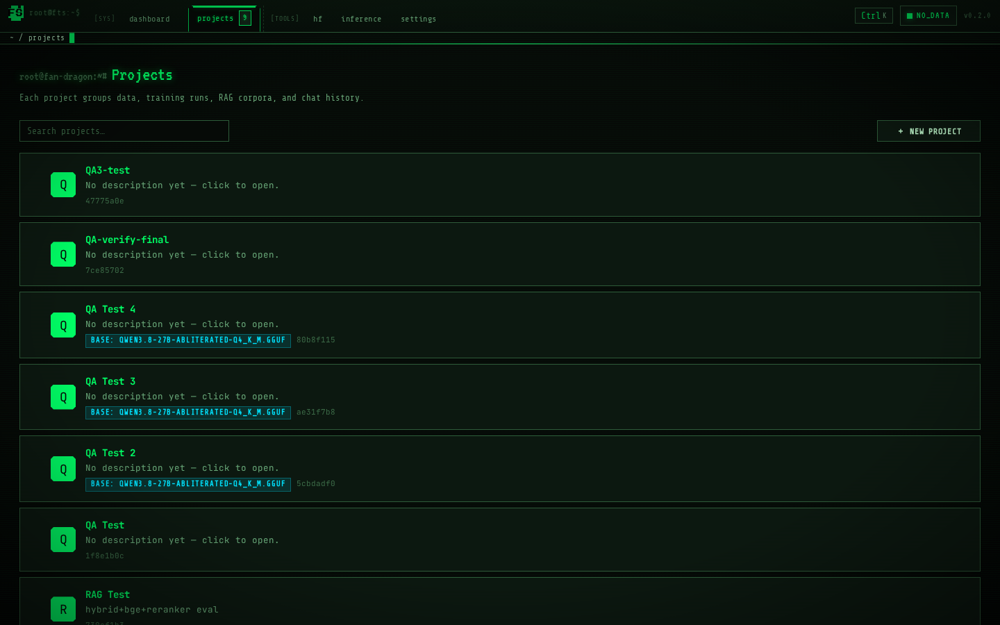

---

### HF Explorer (`/models/explore`)

Browse HuggingFace, search, download GGUF + safetensors, delete to free
disk. All models land in `~/.cache/huggingface`.

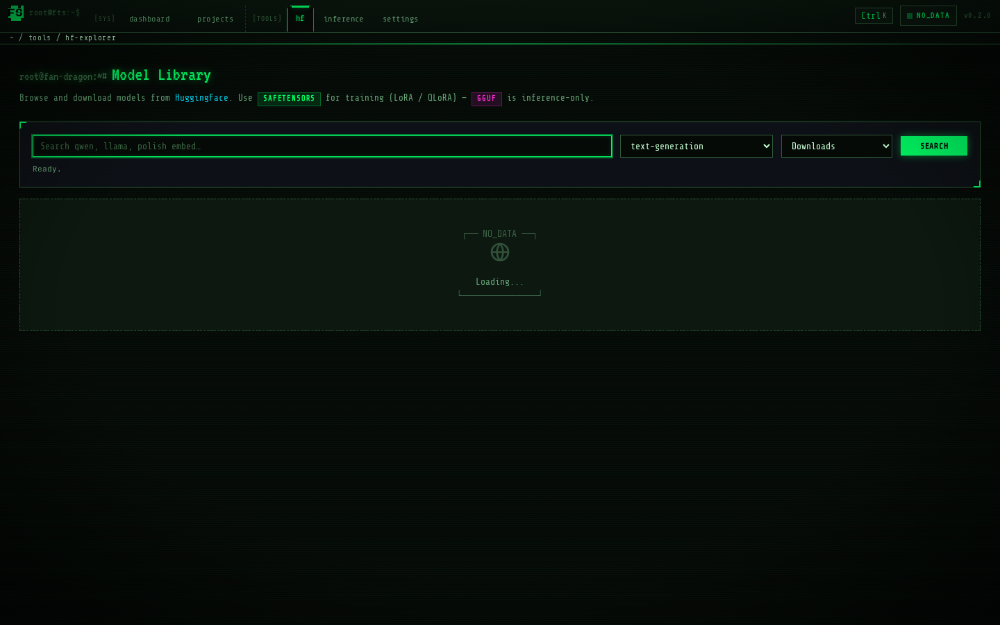

---

### Inference (`/inference`)

Pick a model, load it, chat. Vision support for multimodal models. The
RobotHead sprite pulsates its mouth as each token streams in.

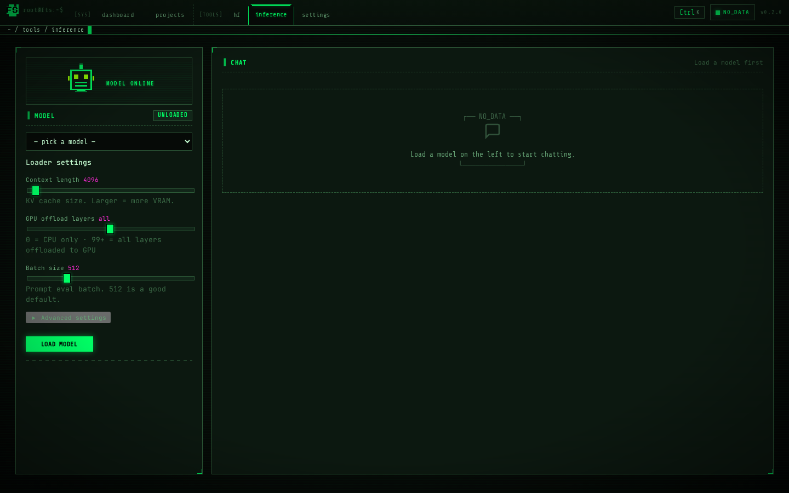

---

### Project overview (`/projects/{pid}`)

Per-project dashboard: data count, RAG status, training run history,
latest benchmark scores.

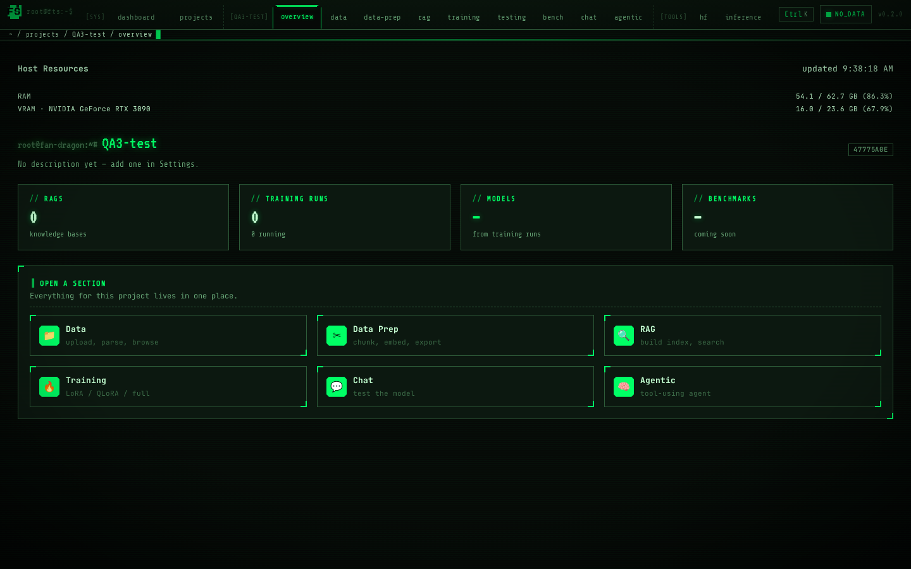

---

### Data prep (`/projects/{pid}/data-prep`)

Upload files, configure chunking + difficulty, kick off a QA-generation
job. The DataStream sprite shows bytes flowing through the parser.

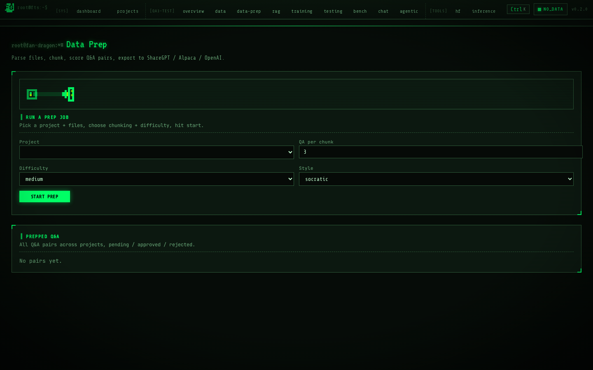

---

### RAG (`/projects/{pid}/rag`)

Build a corpus, search it, tune retrieval parameters. The CorpusNode
sprite shows document nodes connecting to embedding vectors in real time.

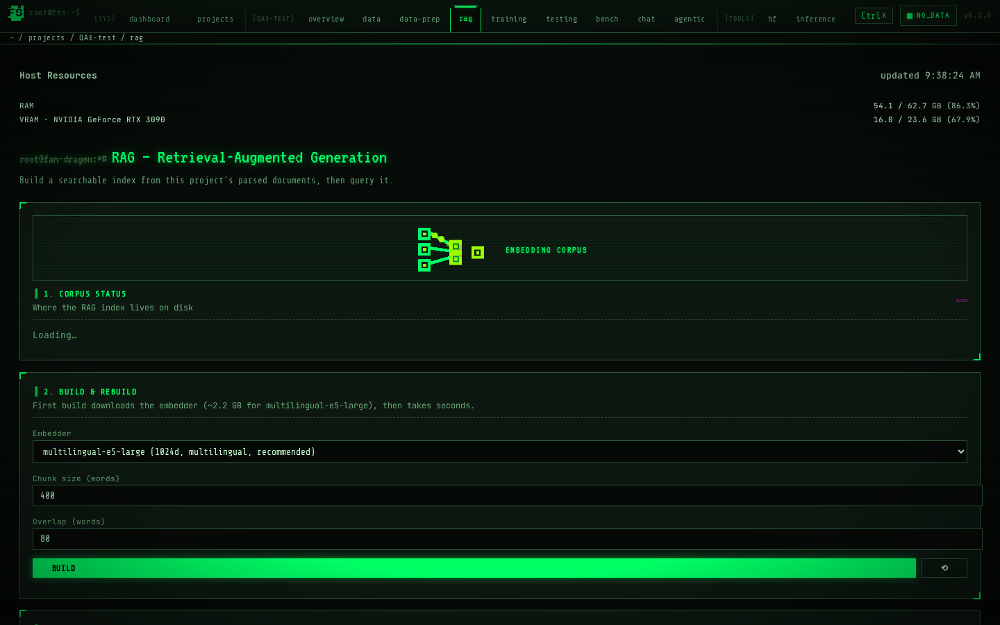

---

### Training (`/projects/{pid}/training`)

Configure a fine-tune, watch loss curves live. The CpuChip sprite
flickers as the GPU accelerates.

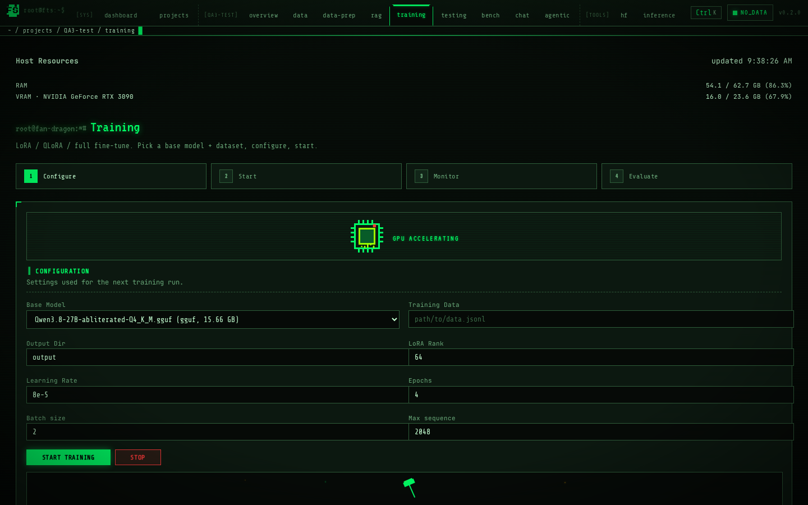

---

### Benchmarks (`/projects/{pid}/benchmarks`)

Run MMLU / HellaSwag / ARC / TruthfulQA / GSM8K / Winogrande. Compare
results across runs. The BenchBars sprite fills in as scores arrive.

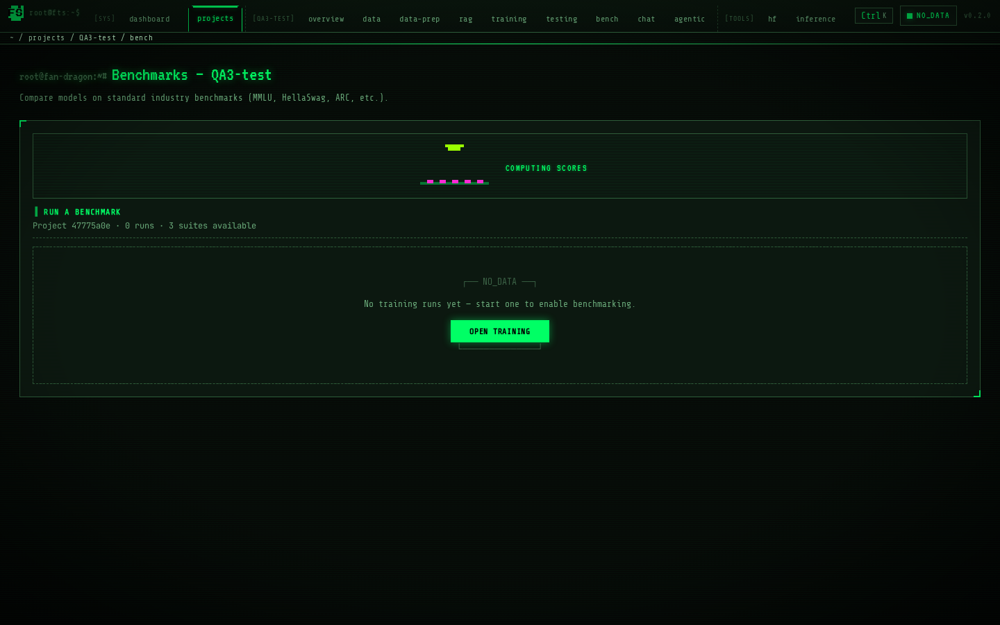

---

### Chat (`/projects/{pid}/chat`)

Per-project chat with the trained or base model. Conversation history
persists across sessions.

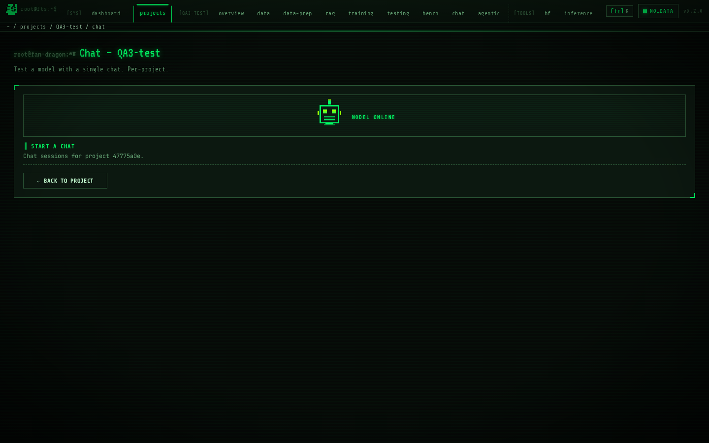

---

### Settings (`/settings`)

Debug info (version, GPU, packages, paths), replay the onboarding
tutorial, hotkey reference.

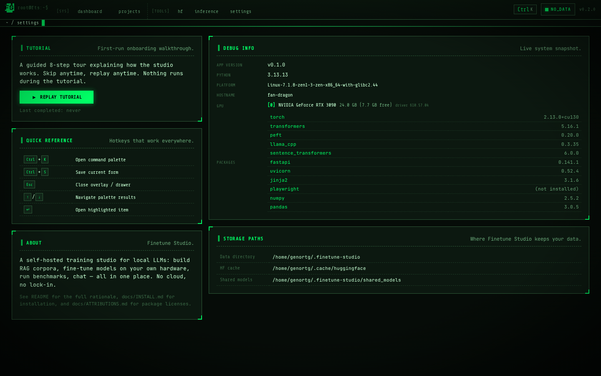

---

The session bar at the top of every page is a Tmux-style tab strip with
three groups: **[SYS]**, **[PROJECT]**, **[TOOLS]**. The active tab has a
phosphor-green notch that punches into the active-path bar below it.
`Ctrl+K` opens the command palette — fuzzy-search any page in any
project.

---

## Quickstart

```bash
git clone https://github.com/GenorTG/finetune-studio.git
cd finetune-studio
./install.sh                       # auto-detects GPU
source .venv/bin/activate
fts web --host 0.0.0.0 --port 7860
```

Open http://localhost:7860. The first visit walks you through an 8-step
onboarding tour.

---

## Installation

See **[docs/INSTALL.md](docs/INSTALL.md)** for full step-by-step
instructions covering Linux (Ubuntu / Fedora / Arch), Windows 10/11, and
macOS (Intel + Apple Silicon), with prerequisites and how to install
each one from its official source.

---

## How it works

```
┌───────────────────── BROWSER (any modern) ─────────────────────┐
│                                                                │
│   Tmux-style session bar ─── project tabs ── status pill       │
│   ┌──────────────────────────────┐  ┌────────────────────────┐ │
│   │ FastAPI + Jinja2 templates   │  │ Live SSE for progress  │ │
│   │ Vanilla JS / CSS (no build)  │  │ Chat streaming         │ │
│   └──────────────────────────────┘  └────────────────────────┘ │
└────────────────────────────────────────────────────────────────┘
                              │  HTTP + Server-Sent Events
                              ▼
┌───────────────────── PYTHON SERVER (local) ─────────────────────┐
│                                                                │
│   FastAPI app ── projects API ── RAG pipeline                  │
│               ── training runner (trl+peft)                    │
│               ── inference (transformers OR llama.cpp)         │
│               ── benchmarks (MMLU/HellaSwag/...)               │
│                                                                │
│   Storage: SQLite + ~/.cache/huggingface + ~/.finetune-studio/ │
└────────────────────────────────────────────────────────────────┘
```

- **Backend:** FastAPI + Jinja2. ASGI server (Uvicorn).
- **Frontend:** Vanilla HTML + CSS + JS. No build step. Sprites are
  inline SVG with CSS keyframe animations.
- **Storage:** SQLite for project metadata, ChromaDB for RAG vectors,
  HuggingFace `~/.cache/` for model weights.
- **Streaming:** Server-Sent Events for live progress on RAG build,
  training, and benchmark runs.
- **Inference:** Either HuggingFace Transformers (full precision / LoRA)
  or llama.cpp (GGUF quantized).
- **Testing:** Playwright live-browser tests in `tests/e2e_ui_qa.py`.

---

## Tech stack

Python — `fastapi` `uvicorn` `jinja2` `aiosqlite` `pydantic`
ML — `torch` `transformers` `trl` `peft` `bitsandbytes`
RAG — `sentence-transformers` `chromadb` `llama-cpp-python`
Web — vanilla HTML/CSS/JS, Google Fonts (JetBrains Mono, Share Tech Mono,
VT323, Press Start 2P)
Tests — `playwright`

Full list with versions and licenses → **[docs/ATTRIBUTIONS.md](docs/ATTRIBUTIONS.md)**

---

## Documentation

- **[docs/INSTALL.md](docs/INSTALL.md)** — install on Linux / macOS / Windows, prerequisites, troubleshooting
- **[docs/ATTRIBUTIONS.md](docs/ATTRIBUTIONS.md)** — every package, version, license
- **[/settings](http://localhost:7860/settings)** — live debug info on your running instance (version, GPU, packages, paths)
- Tools → Settings → **Replay Tutorial** — built-in onboarding, always available

---

## Contributing

PRs welcome. Open an issue first if the change is large — this codebase
prefers clear minimal patches over sweeping refactors. The studio tests
itself via live browser (`tests/e2e_ui_qa.py`) and we ask new features
add at least one assertion there.

---

## License & attributions

**MIT license.** See `LICENSE`.

Every dependency used is open source — see
**[docs/ATTRIBUTIONS.md](docs/ATTRIBUTIONS.md)** for the full list,
versions, and licenses. Thank you to the maintainers of PyTorch,
Transformers, PEFT, llama.cpp, ChromaDB, SentenceTransformers, FastAPI,
Jinja, and the rest of the open-source ecosystem this is built on.

---

<div align="center">

Built by a hacker, for hackers. No cloud, no telemetry, no lock-in.

</div>
